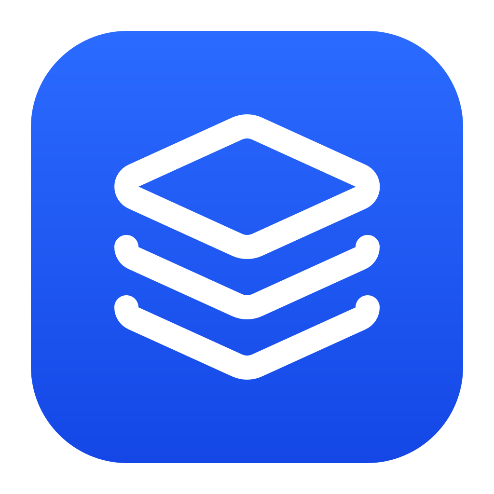
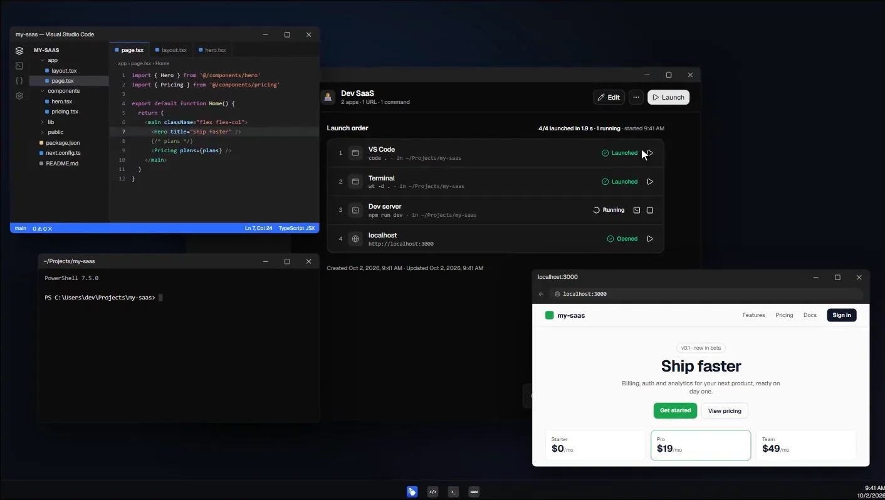
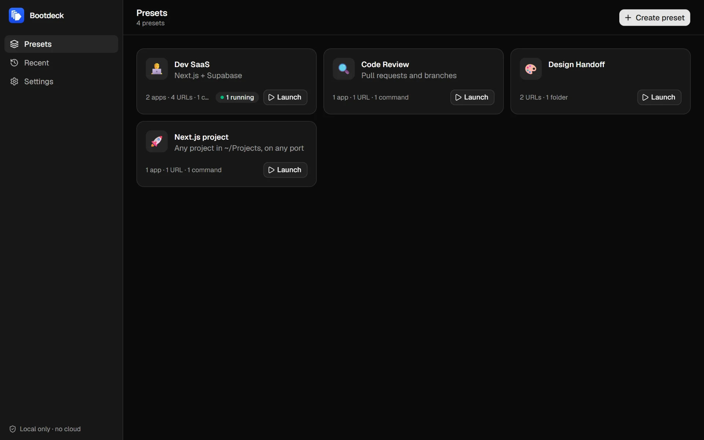
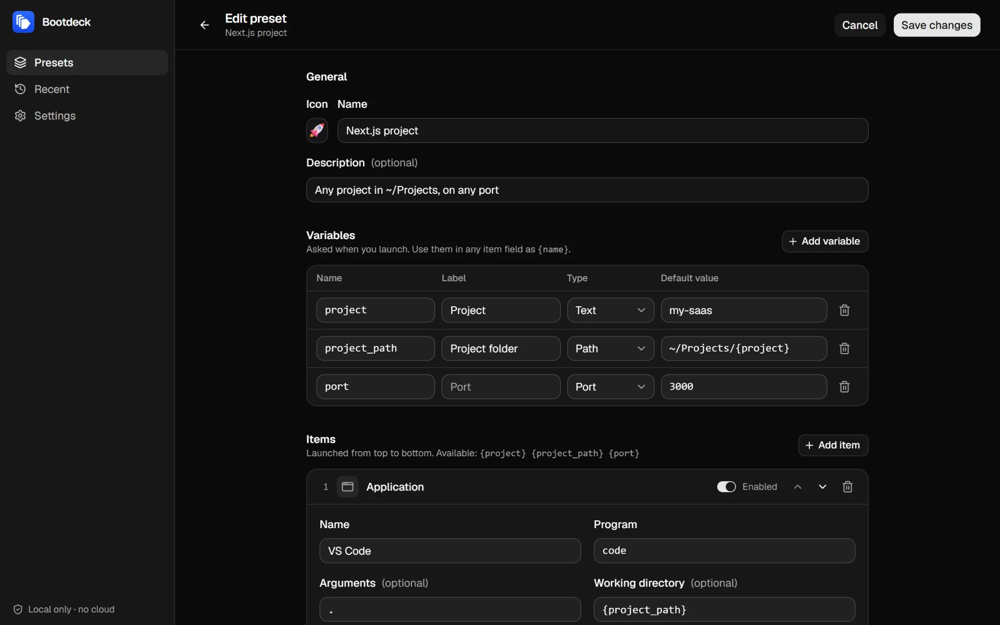
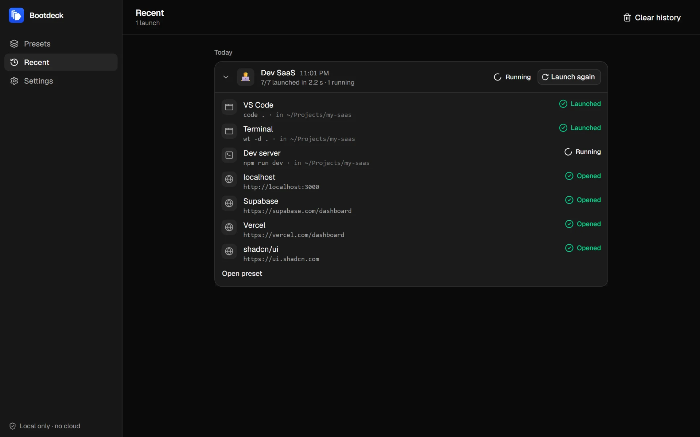

<div align="center">
  
  <h1>Bootdeck</h1>
  <p><strong>Your whole work environment, one click away.</strong></p>
  <p>
    Open your editor, terminal, dev servers, web pages and folders together, in the right order.<br>
    Then see what launched, what is running and what failed.
  </p>
  <p>
    <a href="https://github.com/garerim/bootdeck/releases/latest"></a>
    <a href="LICENSE"></a>
    
    
  </p>
  <p>
    <a href="https://github.com/garerim/bootdeck/releases/latest"><strong>Download for Windows</strong></a>
    &nbsp;&middot;&nbsp;
    <a href="https://bootdeck.app">Website and demo</a>
    &nbsp;&middot;&nbsp;
    <a href="docs/linux.md">Linux guide</a>
    &nbsp;&middot;&nbsp;
    <a href="CONTRIBUTING.md">Contributing</a>
  </p>
  <br>
  
</div>

## Why Bootdeck

Every morning starts the same way: open the editor in the right folder, open a terminal, run `npm run dev`,
open `localhost:3000`, then the same dashboards and docs. Seven steps by hand, and as many chances to forget one.

Bootdeck turns that routine into a **preset**. Press **Launch** and everything opens, one item after another,
with a clear status for each: launched, running, opened or failed (and why).

## Features

- **Presets for every project.** One per project, client or routine, with a name, an icon and a description.
- **Four kinds of items.** Applications (with arguments and a working folder), web pages (in your default
  browser), folders (in the file explorer) and commands (with live output, exit code and a Stop button).
- **Launch in order, with a status per item.** When something fails, you see why ("command not found",
  missing program or folder) and get a link to fix the item.
- **Variables.** Write `{project}` or `{port}` once and use them in any field. Bootdeck asks for the values at
  launch and validates them, so no shell special character can slip into a command.
- **Commands that clean up after themselves.** Commands stop when Bootdeck closes, so a dev server never keeps a
  port busy in the background. On Windows, this holds even if the app crashes.
- **Alerts in the background.** If a dev server stops with an error while you are on another screen, a
  notification tells you.
- **History.** The last 200 launches, with the values used and the result of each item. Launch again in one click.
- **Keyboard first.** <kbd>Ctrl</kbd>+<kbd>N</kbd> new preset, <kbd>Ctrl</kbd>+<kbd>S</kbd> save,
  <kbd>Ctrl</kbd>+<kbd>Enter</kbd> launch, <kbd>Esc</kbd> back, <kbd>Ctrl</kbd>+<kbd>,</kbd> settings.
- **Local only.** Presets live in a readable JSON file on your disk. No account, no cloud, no telemetry.

<table>
  <tr>
    <td width="33%"></td>
    <td width="33%"></td>
    <td width="33%"></td>
  </tr>
  <tr>
    <td align="center">Presets</td>
    <td align="center">Editor and variables</td>
    <td align="center">Launch history</td>
  </tr>
</table>

## Install

### Windows

Windows 10 or 11, 64-bit.

1. Download `Bootdeck_<version>_x64-setup.exe` from the [latest release](https://github.com/garerim/bootdeck/releases/latest).
2. Run it. No administrator rights are needed: Bootdeck installs for your user only.
3. Open Bootdeck from the Start menu and create your first preset.

The installer is not code-signed yet, so Windows SmartScreen may warn you. Click **More info**, then
**Run anyway**, or [build it yourself](#build-from-source). Bootdeck needs WebView2, which comes with
Windows 11; on Windows 10 the installer adds it if it is missing.

### Linux (preview)

Bootdeck builds and runs on Linux, but no package is published yet. The [Linux guide](docs/linux.md) explains
how to build it (`.deb`, `.rpm` or AppImage) and what differs from Windows. Feedback from real Linux desktops
is very welcome.

### macOS

Not supported yet. The code is shared with macOS but has never been built there: contributions are welcome.

## Getting started

1. **Create a preset** with <kbd>Ctrl</kbd>+<kbd>N</kbd>: give it a name and an icon.
2. **Add items** in the order they should open: an application (`code` with the argument `.`), a command
   (`npm run dev` in `~/Projects/my-app`), a web page (`http://localhost:3000`), a folder.
3. **Launch** with <kbd>Ctrl</kbd>+<kbd>Enter</kbd>. Each item shows its status. Commands keep running, with
   their output one click away.

### Variables

A preset can declare variables that are asked at each launch and usable in every item field:
`~/Projects/{project}`, `http://localhost:{port}`. One preset then works for all your projects.

| Type | Accepts | Example |
| ---- | ------- | ------- |
| text | letters, digits, `.`, `-`, `_` | `my-saas` |
| path | an absolute path or one starting with `~` | `~/Projects/my-saas` |
| port | a number from 1 to 65535 | `3000` |

- A default value can use the variables declared before it: `~/Projects/{project}`.
- `{{` and `}}` write literal braces. `{Upper}` or `{"json": 1}` are not variables.
- Shell special characters are never accepted in a value, so a value can never add a command.

## Your data

Everything stays in readable JSON files on your computer:

| OS | Folder |
| -- | ------ |
| Windows | `%APPDATA%\dev.bootdeck.desktop\` |
| Linux | `~/.local/share/dev.bootdeck.desktop/` |

- `presets.json` holds your presets. The exact path is shown in **Settings**. If the file ever becomes
  unreadable, Bootdeck does not touch it: it offers to set it aside (`presets.invalid-<timestamp>.json`)
  and start from an empty list.
- `sessions.json` holds the launch history, separately. If it becomes unreadable, it is set aside and
  restarted automatically, without ever touching your presets.

## Privacy and security

A launcher runs commands on your machine, so it has to earn that trust:

- **Nothing leaves your computer.** No account, no telemetry, no update server. The only network activity
  is the web pages you choose to open, in your browser.
- **Commands run only when you click Launch.** You write them; nothing starts on its own, and no remote
  content can trigger a command.
- **Locked down.** Minimal Tauri permissions and a strict Content Security Policy: the interface cannot load
  code from the internet. Every input from the interface is validated again in Rust.

Found a vulnerability? Please report it privately: see [SECURITY.md](SECURITY.md).

## Build from source

Requirements: Node.js 24+, Rust stable and, on Windows, Visual Studio 2022 with the "Desktop development
with C++" workload. Linux requirements are in the [Linux guide](docs/linux.md).

```bash
git clone https://github.com/garerim/bootdeck.git
cd bootdeck
npm install
npm run dev      # the app with hot reload
npm run build    # the Windows installer, in src-tauri/target/release/bundle/nsis
```

`npm run dev:web` runs the interface alone in a browser, with a simulated system and demo presets: handy
to work on the UI without launching anything for real.

## Built with

[Tauri 2](https://tauri.app) and Rust for the native side (process management, Windows Job Objects, atomic
storage), React 19, TypeScript, Vite, Tailwind CSS 4, shadcn/ui, Zustand and Zod for the interface. Tested
with Vitest, `cargo test` and Playwright. The architecture and the test strategy are described in
[CONTRIBUTING.md](CONTRIBUTING.md).

## Contributing

Bug reports, ideas and pull requests are welcome. Testing on Linux and macOS is especially helpful.
Start with [CONTRIBUTING.md](CONTRIBUTING.md), and please follow the [code of conduct](CODE_OF_CONDUCT.md).

## License

[MIT](LICENSE) © 2026 garerim
